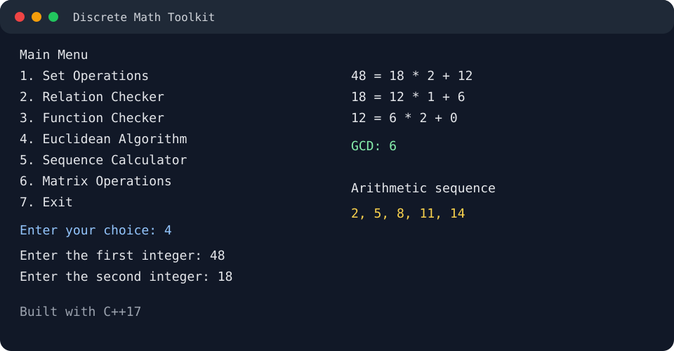

# Discrete Math Toolkit in C++

A command-line toolkit that brings common discrete-mathematics calculations into one interactive C++ program. It was built to turn classroom concepts into working code while practicing program structure, input validation, and testing.

## Features

- Set union, intersection, difference, and Cartesian product
- Reflexive, symmetric, transitive, and equivalence-relation checks
- Function validity, injectivity, and bijectivity checks
- Euclidean algorithm with every division step displayed
- Arithmetic and geometric sequence generation
- Addition, subtraction, and multiplication of 2x2 matrices
- Input validation and menus that can be reused without restarting

## Mathematical Concepts

The project applies set theory, ordered pairs, relations, functions, the Euclidean algorithm, arithmetic and geometric progressions, and matrix arithmetic.

## Technologies

- C++17
- Standard Template Library containers and algorithms
- Git and GitHub

## Project Structure

```text
discrete-math-toolkit-cpp/
├── main.cpp
├── SetOperations.cpp
├── SetOperations.hpp
├── Relations.cpp
├── Relations.hpp
├── Functions.cpp
├── Functions.hpp
├── NumberTheory.cpp
├── NumberTheory.hpp
├── Sequences.cpp
├── Sequences.hpp
├── Matrices.cpp
├── Matrices.hpp
├── README.md
├── .gitignore
└── screenshots/
```

Each feature has its own header and implementation file. `main.cpp` connects all six calculators through the main menu.

## Build and Run

From the project folder, compile with warnings enabled:

```bash
g++ -std=c++17 -Wall -Wextra -Wpedantic *.cpp -o discrete_math_toolkit
```

Run on macOS or Linux:

```text
./discrete_math_toolkit
```

Run on Windows:

```powershell
.\discrete_math_toolkit.exe
```

## Usage

Choose a feature from the main menu, follow its prompts, then return to the feature menu or main menu. Inputs that require integers reject non-integer values and ask again.

Relations use a set indexed from `0` to `n - 1`. For example, a set with three elements uses the values `0`, `1`, and `2`.

## Sample Outputs

Euclidean algorithm:

```text
Enter the first integer: 48
Enter the second integer: 18
48 = 18 * 2 + 12
18 = 12 * 1 + 6
12 = 6 * 2 + 0

GCD: 6
```

Arithmetic sequence:

```text
Enter the first term: 2
Enter the common difference: 3
Enter the number of terms: 5
Sequence: 2, 5, 8, 11, 14
```

Matrix multiplication:

```text
Matrix A:       Matrix B:       Result:
1  2            5  6            19  22
3  4            7  8            43  50
```

## Screenshot



## Challenges

The main challenges were keeping invalid input from breaking menu flow, checking mathematical properties from ordered pairs, and preventing sequence calculations from overflowing.

## What I Learned

This project strengthened my understanding of modular C++ design, vectors, sets, maps, nested loops, input recovery, overflow checks, and testing interactive programs.

## Future Improvements

- Support user-selected matrix dimensions
- Accept decimal ratios in geometric sequences
- Let users enter named set values in the relation checker
- Add automated unit tests
